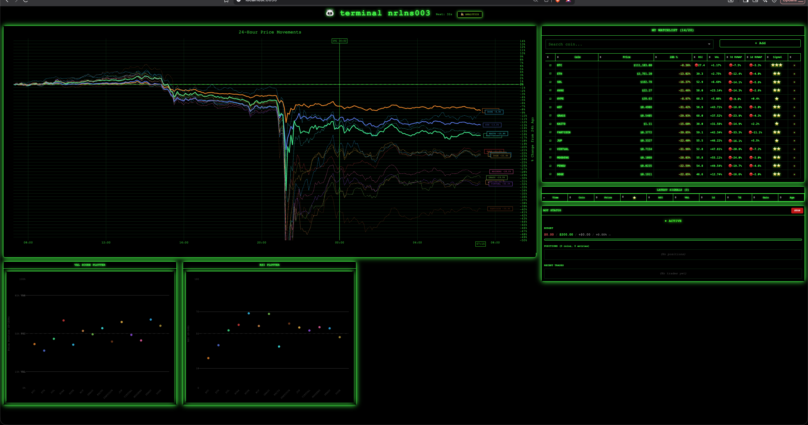
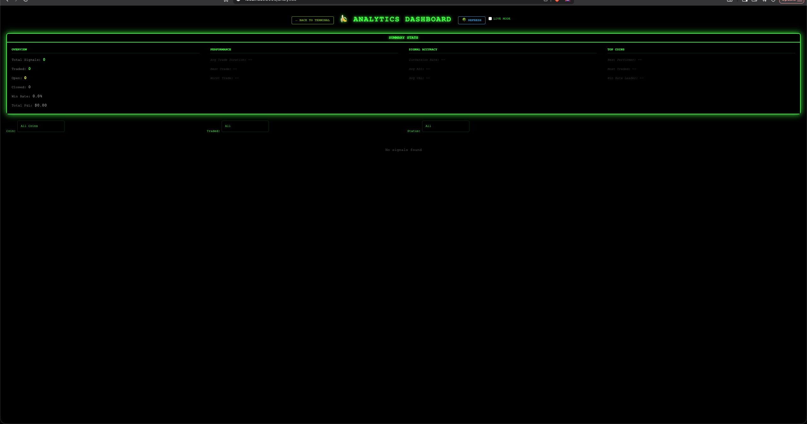

# 🐼 Advanced Crypto Trading Terminal

A sophisticated, real-time cryptocurrency trading terminal with advanced analytics, signal detection, and automated trading capabilities built for Hyperliquid DEX.

## ✨ Features

### 🎯 **Core Trading Features**
- **Automated Signal Detection**: 4-star signal system with customizable RSI thresholds
- **Real-time Position Management**: Track open positions with live P&L
- **Hyperliquid Integration**: Direct connection to Hyperliquid DEX (testnet & mainnet)
- **Risk Management**: Built-in position sizing and cooldown mechanisms

### 📊 **Advanced Analytics Dashboard**
- **Real-time Performance Tracking**: Win rate, P&L, trade duration analytics
- **Signal Analysis**: Track signal conversion rates and accuracy
- **Historical Data**: Comprehensive trade history and performance metrics
- **Dynamic Charting**: Spaghetti charts with adaptive Y-axis ranges

### 🖥️ **Professional Interface**
- **Matrix-Themed UI**: Sleek dark theme with green terminal aesthetics
- **Multi-page Navigation**: Separate trading terminal and analytics views
- **Real-time Updates**: Live data refresh every minute
- **Responsive Design**: Optimized for various screen sizes

### 🔧 **Technical Features**
- **Dynamic RSI Thresholds**: Configurable oversold/overbought levels
- **Multi-coin Support**: Track up to 50+ cryptocurrencies simultaneously
- **Signal Filtering**: Advanced filtering by coin, trade status, and time
- **Export Capabilities**: CSV export for further analysis

## 🖼️ **UI Examples**

### Trading Terminal Interface
The main trading interface features a sophisticated Matrix-themed design with real-time market data and signal detection:



**Key Components:**
- **🐼 Terminal Header**: Shows bot status with live refresh timer
- **📈 Spaghetti Chart**: Real-time 24-hour price movements for all tracked coins with dynamic Y-axis scaling
- **📋 Watchlist**: Comprehensive coin tracking with RSI, VAL, and RVWAP indicators
- **⚡ Latest Signals**: Real-time signal detection with star ratings
- **🤖 Bot Status**: Live trading status, budget, positions, and P&L
- **📊 Technical Indicators**: RSI and VAL score plotters with configurable thresholds

### Analytics Dashboard
The analytics dashboard provides comprehensive performance tracking and trade analysis:



**Key Components:**
- **📊 Summary Stats**: Four-column layout with overview, performance, signal accuracy, and top coins metrics
- **🔍 Advanced Filtering**: Filter signals by coin, trade status, and time period
- **📈 Performance Tracking**: Win rate, P&L, trade duration, and conversion rate analysis
- **📋 Detailed Tables**: Sortable and filterable signal and trade history
- **🔄 Live Mode**: Real-time updates with manual refresh option

### Visual Highlights
- **Matrix Theme**: Dark background with vibrant green text and glowing accents
- **Real-time Updates**: Live data refresh every minute with visual indicators
- **Responsive Design**: Optimized for desktop and laptop viewing
- **Professional Layout**: Clean, organized interface with intuitive navigation

> 📖 **Detailed UI Documentation**: For comprehensive interface details, component descriptions, and design specifications, see [docs/UI_DESIGN.md](docs/UI_DESIGN.md)

## 🚀 Quick Start

### Option 1: One-Click Setup (Recommended)

```bash
# Clone the repository
git clone https://github.com/yourusername/crypto-trading-terminal.git
cd crypto-trading-terminal

# Run the automated setup script
chmod +x setup.sh
./setup.sh
```

### Option 2: Docker Deployment

```bash
# Clone and run with Docker
git clone https://github.com/yourusername/crypto-trading-terminal.git
cd crypto-trading-terminal

# Start with Docker Compose
docker-compose up -d
```

### Option 3: Manual Setup

```bash
# Install dependencies
pip install -r requirements.txt

# Configure environment
cp .env.example .env
# Edit .env with your API keys

# Start the application
cd terminal
python app.py
```

## 📋 Prerequisites

- **Python 3.9+**
- **Hyperliquid Account** (testnet or mainnet)
- **API Keys** (provided in sample config)
- **8GB RAM** (recommended for smooth operation)

## 🔑 Configuration

### Environment Variables

Create a `.env` file in the root directory:

```env
# Hyperliquid API Configuration
HYPERLIQUID_TESTNET_RPC_URL=https://api.hyperliquid-testnet.xyz/info
HYPERLIQUID_MAINNET_RPC_URL=https://api.hyperliquid.xyz/info

# Wallet Configuration (Testnet)
WALLET_ADDRESS=your_wallet_address_here
PRIVATE_KEY=your_private_key_here

# Trading Parameters
TRADING_BUDGET=200.0
POSITION_SIZE=10.0
RSI_THRESHOLD=18

# Dashboard Configuration
DASHBOARD_HOST=0.0.0.0
DASHBOARD_PORT=8050
UPDATE_INTERVAL_SECONDS=60
```

### Trading Strategy Configuration

The terminal uses a sophisticated 4-star signal system:

```python
# Signal Criteria (all must be met for 4-star signal)
RSI < 18              # Oversold condition
VAL < 0               # Volume analysis
RVWAP_1D < 0         # 1-day relative volume-weighted average price
RVWAP_7D < 0         # 7-day relative volume-weighted average price
```

## 📁 Project Structure

```
crypto-trading-terminal/
├── terminal/                 # Main application
│   ├── app.py               # Dash application entry point
│   ├── components/          # UI components
│   │   ├── analytics_dashboard.py
│   │   ├── spaghetti.py     # Price movement charts
│   │   ├── rsi_plotter.py   # RSI visualization
│   │   └── ...
│   ├── data/                # Data processing
│   │   ├── analytics_db.py  # Database operations
│   │   ├── hyperliquid_api.py
│   │   └── data_processor.py
│   ├── trading/             # Trading logic
│   │   ├── signal_trader.py
│   │   └── position_manager.py
│   └── config.py            # Configuration settings
├── docs/                    # Documentation
│   ├── UI_DESIGN.md         # Detailed UI documentation
│   └── screenshots/         # UI examples and screenshots
├── docker/                  # Docker configuration
│   ├── Dockerfile
│   └── docker-compose.yml
├── scripts/                 # Automation scripts
│   ├── setup.sh            # One-click setup
│   └── deploy.sh           # Deployment script
├── requirements.txt         # Python dependencies
├── .env.example            # Sample environment configuration
└── README.md               # This file
```

## 🎮 Usage

### Starting the Application

```bash
cd terminal
python app.py
```

The application will be available at:
- **Trading Terminal**: http://localhost:8050/
- **Analytics Dashboard**: http://localhost:8050/analytics

### Key Interface Elements

#### Trading Terminal
- **Spaghetti Chart**: Real-time 24h price movements for all tracked coins
- **Watchlist**: Manage your coin selection and view live signals
- **Bot Status**: Monitor active positions and trading performance
- **Signal Feed**: Real-time signal generation and history

#### Analytics Dashboard
- **Summary Statistics**: Performance overview with key metrics
- **Signals Table**: Detailed signal and trade history with filtering
- **Performance Tracking**: Win rate, P&L, and trade duration analysis

### Trading Workflow

1. **Setup**: Configure your wallet and API keys
2. **Watchlist**: Add coins you want to monitor
3. **Activation**: Open a BTC position to activate the bot
4. **Monitoring**: Watch for 4-star signals in real-time
5. **Trading**: Bot automatically executes trades based on signals
6. **Analysis**: Use analytics dashboard to track performance

## 📊 Analytics Features

### Signal Tracking
- **Signal Generation**: Track all 4-star signals detected
- **Conversion Rate**: Percentage of signals that become trades
- **Accuracy Analysis**: Win rate by coin and time period

### Performance Metrics
- **Total P&L**: Cumulative profit/loss across all trades
- **Win Rate**: Percentage of profitable trades
- **Average Trade Duration**: Time from entry to exit
- **Best/Worst Trades**: Individual trade performance analysis

### Filtering & Search
- **By Coin**: Filter signals and trades by specific cryptocurrencies
- **By Status**: View only traded, open, or closed positions
- **By Time**: Date range filtering for historical analysis
- **Export**: Download data for external analysis

## 🔧 Advanced Configuration

### Customizing RSI Thresholds

```python
# In terminal/app.py, line ~320
if rsi < 18:  # Change this value to adjust sensitivity
    criteria_met += 1
```

### Adjusting Trading Parameters

```python
# In terminal/config.py
TRADING_BUDGET = 200.0      # Total trading budget
POSITION_SIZE = 10.0        # Size per position
COOLDOWN_SECONDS = 60       # Time between trades
```

### Database Management

```bash
# View analytics data
sqlite3 terminal/data/analytics.db "SELECT * FROM signals_analytics;"

# Clear historical data
sqlite3 terminal/data/analytics.db "DELETE FROM signals_analytics;"
```

## 🛡️ Security & Safety

### Testnet Usage
- **Default Configuration**: Ships with testnet settings
- **No Real Money**: All trades use testnet funds
- **Safe Testing**: Experiment without financial risk

### API Key Management
- **Environment Variables**: Never hardcode sensitive data
- **Gitignore**: .env files are excluded from version control
- **Sample Keys**: Provided testnet keys for immediate testing

### Risk Management
- **Position Limits**: Configurable maximum position sizes
- **Cooldown Periods**: Prevents overtrading
- **Stop Losses**: Built-in risk management features

## 🐳 Docker Deployment

### Using Docker Compose

```bash
# Start all services
docker-compose up -d

# View logs
docker-compose logs -f

# Stop services
docker-compose down
```

### Using Dockerfile

```bash
# Build image
docker build -t crypto-trading-terminal .

# Run container
docker run -p 8050:8050 --env-file .env crypto-trading-terminal
```

## 📈 Performance Optimization

### System Requirements
- **CPU**: 2+ cores recommended
- **RAM**: 8GB minimum, 16GB recommended
- **Storage**: 1GB for application and data
- **Network**: Stable internet connection for real-time data

### Optimization Tips
- **Close Unused Coins**: Remove coins you're not trading from watchlist
- **Adjust Update Intervals**: Increase interval for lower CPU usage
- **Database Cleanup**: Regularly clean old analytics data
- **Monitor Resources**: Use system monitoring tools

## 🔍 Troubleshooting

### Common Issues

#### Application Won't Start
```bash
# Check Python version
python --version  # Should be 3.9+

# Install dependencies
pip install -r requirements.txt

# Check port availability
netstat -an | grep 8050
```

#### No Signals Generated
- Verify RSI threshold settings
- Check coin watchlist configuration
- Ensure API connectivity
- Review signal criteria logic

#### Trading Not Working
- Verify API keys and wallet configuration
- Check Hyperliquid testnet connection
- Ensure sufficient balance for trades
- Review position management settings

### Log Analysis

```bash
# View application logs
tail -f /tmp/app.log

# Check error messages
grep -i error /tmp/app.log
```

## 🤝 Contributing

### Development Setup

```bash
# Fork the repository
git clone https://github.com/yourusername/crypto-trading-terminal.git
cd crypto-trading-terminal

# Create development branch
git checkout -b feature/your-feature-name

# Install development dependencies
pip install -r requirements-dev.txt
```

### Code Standards
- **Python**: Follow PEP 8 style guidelines
- **Documentation**: Add docstrings to all functions
- **Testing**: Include unit tests for new features
- **Commits**: Use conventional commit messages

## 📄 License

This project is licensed under the MIT License - see the [LICENSE](LICENSE) file for details.

## ⚠️ Disclaimer

**Important**: This software is for educational and research purposes only. Trading cryptocurrencies involves substantial risk of loss. The developers are not responsible for any financial losses incurred through the use of this software.

- **Testnet Only**: Default configuration uses testnet funds
- **No Financial Advice**: Not intended as investment advice
- **Use at Your Own Risk**: Always test thoroughly before live trading

## 🆘 Support

### Getting Help
- **Issues**: Create GitHub issues for bugs and feature requests
- **Discussions**: Use GitHub Discussions for questions
- **Documentation**: Check this README and inline code comments

### Community
- **Discord**: Join our trading community (link in repository)
- **Telegram**: Real-time support and updates
- **Reddit**: Share strategies and get feedback

## 🔄 Updates & Changelog

### Version 3.0 - Analytics Dashboard
- ✅ Complete analytics dashboard implementation
- ✅ Dynamic RSI threshold configuration
- ✅ Advanced signal filtering and search
- ✅ Performance tracking and metrics
- ✅ Professional UI with Matrix theme

### Version 2.0 - Enhanced Trading
- ✅ Multi-coin support
- ✅ Advanced position management
- ✅ Real-time P&L tracking
- ✅ Signal history and analysis

### Version 1.0 - Core Terminal
- ✅ Basic trading terminal
- ✅ Hyperliquid integration
- ✅ Signal detection system
- ✅ Real-time price monitoring

---

**Built with ❤️ for the crypto trading community**

*Happy Trading! 🚀*